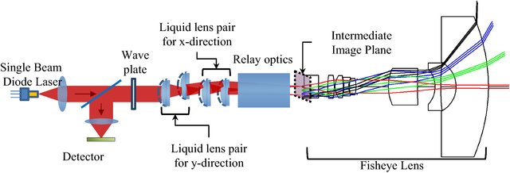

# Lidar

A virtual reality game where you have to find your way out of a maze you can't see. Use your lidar (basically a laser coupled with a light sensor) to find your way out and avoid the obstacles.

The following schematic illustrates how an actual lidar works[^1]:

This project is still in early development. The game is playable but many features are still missing, and will hopefully be added in the future.

## Usage

The app is hosted at [https://lidar.bsodium.fr/](https://lidar.bsodium.fr/). You can also download the source code and run it locally. The app is written in TypeScript React, uses [Joy-UI](https://mui.com/) for the UI and [Three.js](https://threejs.org/) for WebGL and WebXR rendering.

## License

This project is licensed under the MIT License - see the [LICENSE](LICENSE) file for details.

[^1]: [Choi, Hyun & Park, No-Cheol & Kim, Wan-Chin. (2020). Optical system design for light detection and ranging with ultra-wide field-of-view using liquid lenses. Microsystem Technologies. 26. 10.1007/s00542-019-04490-4.](https://www.researchgate.net/publication/333379409_Optical_system_design_for_light_detection_and_ranging_with_ultra-wide_field-of-view_using_liquid_lenses/related)
